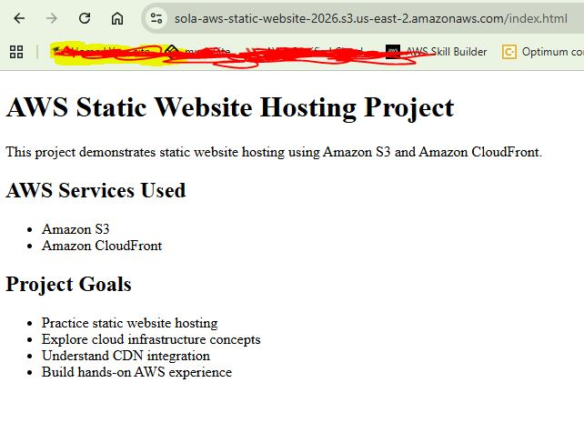

# AWS Static Website Hosting Project

## Overview

This project demonstrates static website hosting on AWS using Amazon S3 and Amazon CloudFront, showcasing cloud storage, content delivery, scalable web hosting, and infrastructure deployment practices.

## AWS Services Used

* Amazon S3
* Amazon CloudFront

## Project Goals

* Practice static website hosting
* Understand AWS storage services
* Explore CDN distribution concepts
* Build hands-on AWS infrastructure experience

## Current Status

Initial project structure and website files created.
## Live Website Screenshot

## Live Website

[View Live AWS Website](http://sola-aws-static-website-2026.s3-website.us-east-2.amazonaws.com)
